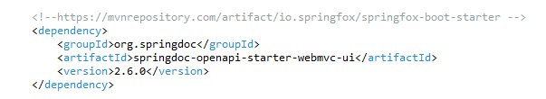
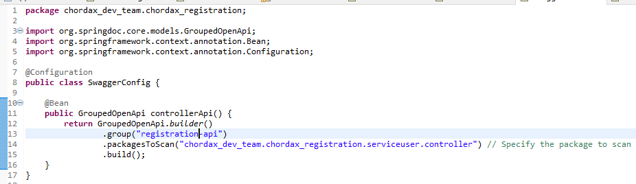
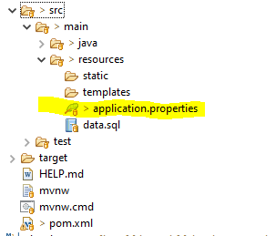

## chordax_registration

# setting swagger

1.add dependency in o.xml file:
 

 
 
2.create configuration class in main package:
 

 

 
 
3.to add descriptions to api documentation, annotations with description should be added in model:
 

 
 
4.toview the swagger console with api documentation, in application.properties file swagger console's url should be mapped to its index.html file:
 

 

 
 
5.the swagger console can be viewed in a browser under url [server-address:port]/[swagger-ui], like:
 

 
- the description from poin3, can be seen under "Schemas" option:
 

